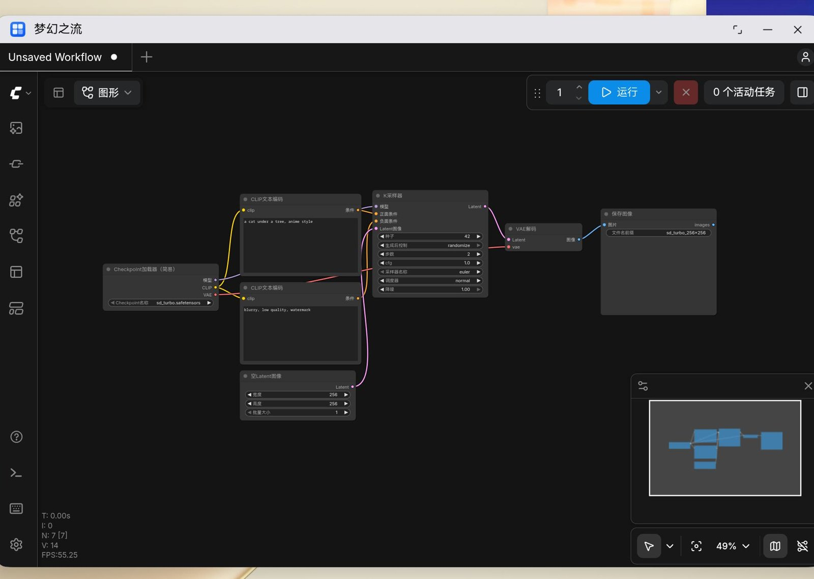
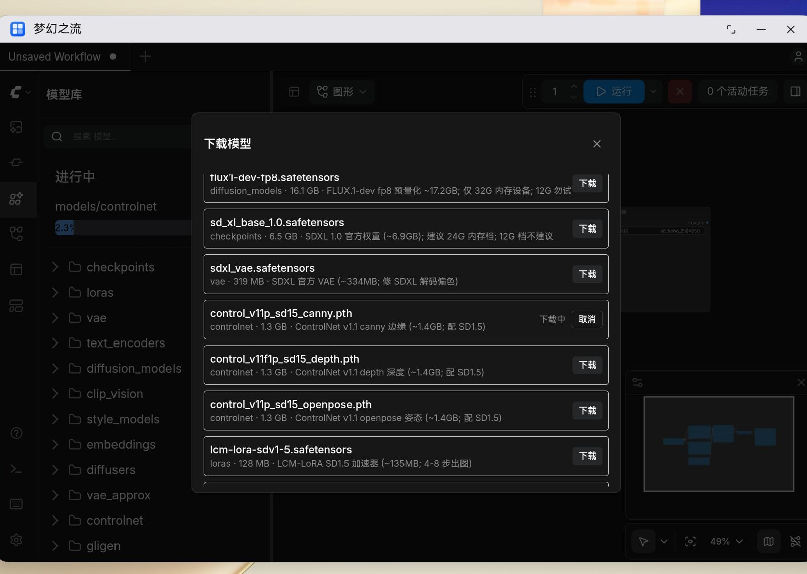

# 梦幻之流(MagicFlow)—— 把 ComfyUI 装进鸿蒙设备

在 HarmonyOS 设备(PC / Pad)上本地运行 ComfyUI:后端以鸿蒙原生子进程方式内嵌
Python 运行时,纯端侧 CPU 推理,全程不需要联网,数据不出设备。



## 主要功能

- **本地生图**:SD-Turbo 256×256 两步出图,24GB 内存机型实测约 19 秒一张。
- **模型一键下载**:内置国内镜像直连的精选模型清单(SD1.5、SDXL、ControlNet、
  LCM-LoRA、VAE、放大模型等),点一下就能用;也可以把从其它渠道下载的模型放进
  `Download/app.fuqidian.magicflow/models/` 对应目录,系统文件管理器可见。
- **完整的 ComfyUI 体验**:基于官方 ComfyUI 0.34 与官方前端 v1.54.4,画布、节点、
  模板与官方一致;前端页面由后端同源提供,开箱即用。



## 安装与使用

1. 设备要求:HarmonyOS 6.x(API 24)的 arm64 设备(PC 或 Pad),内存 12GB 起,
   建议 24GB 以上。
2. 安装签名后的 HAP(或在 DevEco Studio 中直接运行):

   ```bash
   hdc file send entry-default-signed.hap /data/local/tmp/magicflow.hap
   hdc shell bm install -p /data/local/tmp/magicflow.hap
   ```

3. 打开应用,点首页的「启动 梦幻之流」按钮,等待 1~2 分钟进入画布。
4. 缺模型时打开左侧「模型库」,点右上角的下载图标,从清单里挑需要的模型下载,
   完成后模型会出现在节点选择器里。

## 工作原理

应用分成三层:ArkTS 界面负责交互与启动控制,一个鸿蒙原生子进程(NCP)内嵌 Python
运行时并运行 ComfyUI 后端,界面层用 WebView 加载后端同源提供的前端页面。

```
ArkTS 界面 (Index.ets)        NCP 子进程                      WebView
  点「启动」  ───────────▶  comfy_child.cpp
                            └─ 内嵌 Python 3.12 + PyTorch
                               └─ ComfyUI 后端 (:8188)  ───▶  官方前端页面(同源加载)
```

- 后端只在点击「启动」后运行,退出应用即停止,没有常驻进程;
- Python 运行时与全部原生库都打包在 HAP 内,安装后无需联网即可使用;
- 出图与模型全部留在本机,不上传任何数据。

## 从源码构建

构建需要一台 x86_64 Linux 机器和完整的鸿蒙工具链(CLT 6.1.1.280,安装到
`/apps/harmony`)。整个流程可以完整复现,所有外部依赖都带校验锚点。

```bash
make fetch      # 1. 下载全部外部依赖到 externals/(sha256 校验, 可重复执行)
make extract    # 2. 解包预编译的 Python 运行时
make stage      # 3. 收集 ComfyUI 源码(打适配补丁)+ Python 依赖 + 前端产物
make rust       # 4. 编译两个 Rust 扩展(产物 sha 比对)
make zip        # 5. 打包运行时 python312.zip(约 3.6 万条目, 带清单锚)
make prebuilt   # 6. 按清单收集原生库(325 个文件, sha 闭环校验)
make hap        # 7. 构建出 entry-default-signed.hap
make install    # 8. 安装到真机并启动
make verify     # 9. 端到端验收: 装机 → 启动 → 矩阵运算 → 出图(约 5 分钟)
```

每一步失败都会立即停止,不会带着错误继续往下走。外部资源的版本与校验值见
`config/externals.pins.tsv`,预置库清单见 `config/prebuilt_manifest.tsv`。

## 目录结构

| 目录 | 说明 |
|---|---|
| `entry/` | 鸿蒙应用工程(ArkTS 界面、NCP 子进程宿主、资源) |
| `patches/` | ComfyUI 源码适配补丁(主补丁 + 9 个功能补丁, 含下载端点、国内镜像清单与外部 API 节点组) |
| `scripts/` | 构建与验证脚本(构建流程入口) |
| `thirdparty/` | 子模块:前端 fork、tokenizers、safetensors |
| `config/` | 外部依赖版本锚点与预置库清单 |
| `stub/` | 运行时缺失依赖的空壳实现 |
| `docs/` | 设计与验证文档 |
| `externals/`、`build/` | 下载与构建产物(不纳入版本管理) |

## 工具链基线

CLT 6.1.1.280 / hvigor 6.24.2 / SDK 6.1.1 (API 24) / hdc 3.2.0d /
rustc 1.98.0(`aarch64-unknown-linux-ohos`)/ Node.js 25。

## 已知限制

- **出图分辨率上限 256**:受设备进程内存限制,512 及以上会因内存触顶被系统终止;
- **启动需要 1~2 分钟**:首次启动要解压三万余个运行时文件并载入完整 PyTorch,
  属于架构上的固定成本;
- **部分节点不可用**:为控制安装包体积,少数使用频率低的依赖没有打包,对应的
  视频、图像预处理等节点无法使用;
- **暂不支持 NPU / GPU 加速**:当前为纯 CPU 推理。NPU 路线已验证不可行 —— 设备侧 NNRt
  不支持卷积算子,而卷积是出图的算力主体,端到端加速不成立(验证记录见
  [poc/npu/README.md](poc/npu/README.md) 顶部的修正说明)。

以上限制的原因、数据与完整清单见 [docs/known-limitations.md](docs/known-limitations.md)。

## 许可与致谢

本项目以 **GPL-3.0** 许可发布(见 [LICENSE](LICENSE))—— 因为分发的安装包中
包含以 GPL-3.0 授权的 ComfyUI 代码。

感谢以下开源项目:

- [ComfyUI](https://github.com/comfyanonymous/ComfyUI)—— 后端与节点生态
- [ComfyUI Frontend](https://github.com/Comfy-Org/ComfyUI_frontend)—— 界面
- [thirdparty_pytorch](https://gitcode.com/openharmony-robot/thirdparty_pytorch)—— 鸿蒙 PyTorch 运行时
- 以及 Stability AI、Real-ESRGAN 等模型提供方
